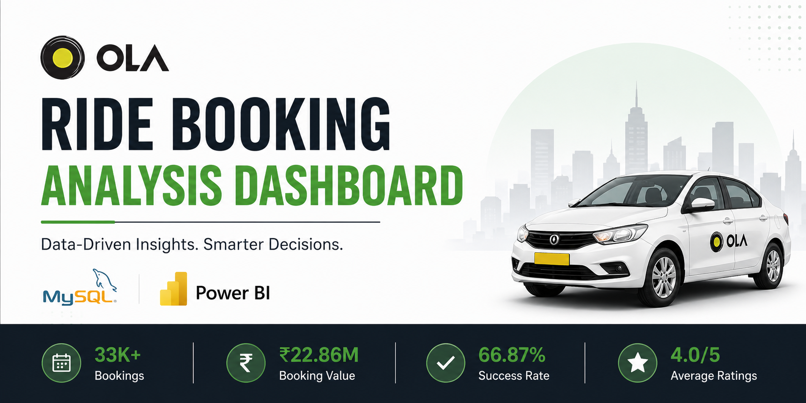
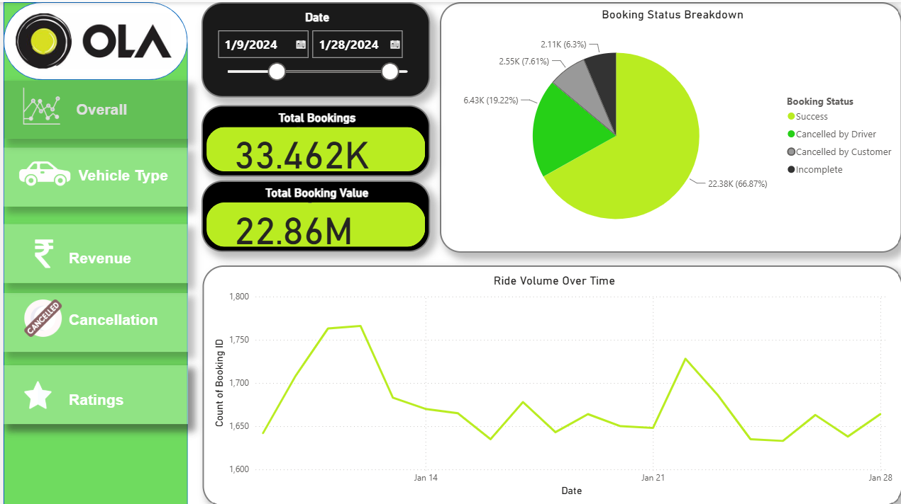

<p align="center">
  
</p>

# 🚖 Ola Ride Booking Analysis Dashboard | SQL + Power BI

## 📖 Project Overview

This project analyzes **33.46K ride bookings** using **MySQL** and **Power BI** to uncover insights related to booking performance, revenue generation, customer behavior, vehicle utilization, cancellations, and service quality.

The objective is to transform raw booking data into actionable business insights through data cleaning, SQL analysis, and interactive dashboarding.

---

## 🎯 Business Problem

Ride-hailing platforms generate large volumes of operational data daily. Without proper analysis, it becomes difficult to:

* Monitor booking performance
* Track revenue trends
* Understand cancellation patterns
* Evaluate vehicle category utilization
* Measure customer satisfaction

This dashboard provides a centralized view of key business metrics to support data-driven decision-making.

---

## Dashboard Preview


## 📌 Dashboard Pages

* Overall Performance
* Vehicle Type Analysis
* Revenue Analysis
* Cancellation Analysis
* Ratings Analysis

---

## 📊 Key Project Metrics

| KPI                    | Value   |
| ---------------------- | ------- |
| Total Bookings         | 33.46K  |
| Total Booking Value    | ₹22.86M |
| Successful Bookings    | 22.38K  |
| Cancellation Rate      | 26.83%  |
| Top 5 Customer Revenue | ₹18.92K |
| Average Ratings        | 4.0 / 5 |

---

## 📈 Key Insights

### Booking Performance

* Successfully completed rides accounted for **66.87%** of all bookings.
* Daily ride volume remained stable at approximately **1.6K–1.8K rides per day**.

### Vehicle Performance

* **Bike** and **Prime Sedan** generated the highest booking value at approximately **₹3.33M** each.
* Average ride distance remained consistent across vehicle categories at approximately **25 km**.

### Revenue Analysis

* Total booking revenue reached **₹22.86M**.
* The highest spending customer generated **₹3,929** in booking value.
* Top 5 customers contributed **₹18,919** in revenue.

### Cancellation Analysis

* Approximately **8.98K rides** were cancelled.
* Overall cancellation rate reached **26.83%**.
* The leading customer cancellation reason was **Driver not moving toward pickup location**.
* The leading driver cancellation reason was **More than permitted passengers**.

### Customer Experience

* Customer and driver ratings remained highly consistent across all vehicle categories.
* Average ratings were maintained at approximately **4.0/5**, indicating strong service quality.

---

## 📂 Repository Structure

```text
ola-ride-booking-analysis/
│
├── datasets/
├── dashboard/
├── screenshots/
├── insights/
├── sql/
├── docs/
├── README.md
└── LICENSE
```

---

## 🛠️ Tools & Technologies

* MySQL
* Power BI
* DAX
* Power Query
* Data Visualization
* Data Analysis

---

## 🌱 About Me

Hi, I'm **Shraddha Bisht**.

I'm passionate about Data Analytics, SQL, Power BI, and Business Intelligence. I enjoy building projects that transform raw data into meaningful business insights and support data-driven decision-making.

If you found this project interesting, feel free to connect with me on LinkedIn.


Feel free to connect with me and explore my other projects.
